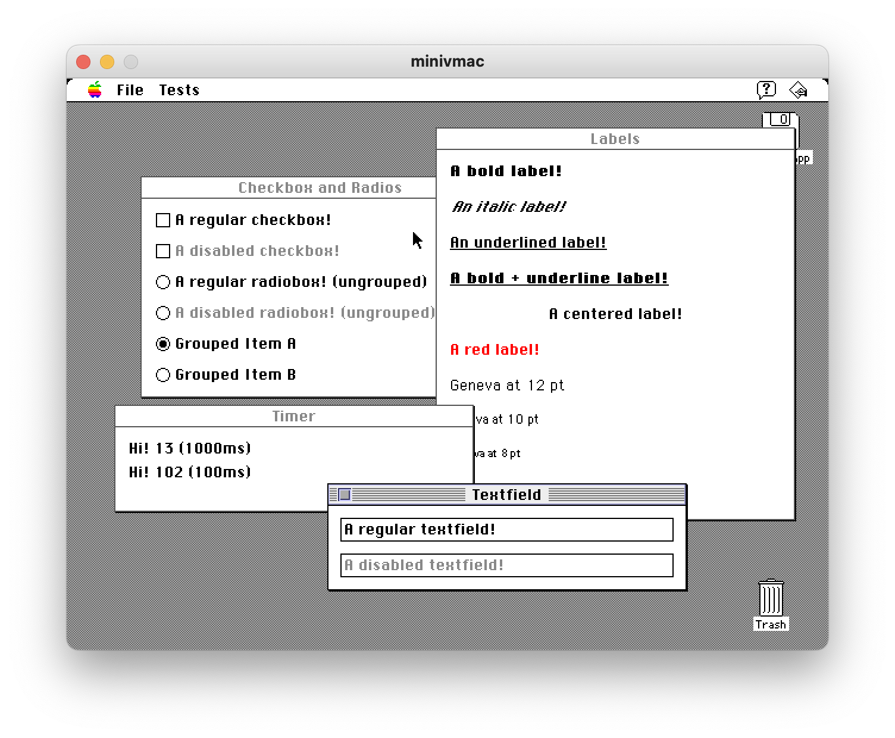

Clapkit (CLassic APplication KIT) is a framework for developing applications for Classic Mac OS (System 7.x - Mac OS 9.x), basically a C++/object-oriented wrapper for Macintosh Toolbox functions. 

It builds using [Retro68](https://github.com/autc04/Retro68) on modern systems and is designed to make application development for Mac OS 7.x - 9.x easier by doing most of the manual work one has to do when it comes to Toolbox programming.

The goal is to eventually add Carbon/Cocoa and even Win32 support to allow cross-platform development.

#### Warning
Clapkit is in very early stages of development. A lot of things are either not supported or how they work are subject to change. 

## Features

* "Modern-style" wrappers for basic Macintosh Toolbox functions.
  * Easily create windows (CKWindow), controls (CKButton, CKLabel, etc.) and objects (like timers with CKTimer) using modern C++ syntax and lambda expressions.
* Basic networking support with event-based MacTCP wrapper implementation.
* Simple debug tools including debug logs and leaks checking.



## Installation

To 'import' Clapkit, you can use FetchContent:

```CMake
include(FetchContent)
FetchContent_Declare(
    clapkit
    GIT_REPOSITORY https://github.com/macinlink/clapkit.git
    GIT_TAG main
)
FetchContent_MakeAvailable(clapkit)
target_link_libraries(my_project PRIVATE clapkit)
```

You may need CMakeLists.txt and .vscode/c_cpp_properties.json modified to point to your Retro68 installation. Example:

```JSON
{
    "configurations": [
        {
            "name": "Mac",
            "includePath": [
                "${workspaceFolder}/**",
                "${workspaceFolder}/**/**",
                "~/Retro68/InterfacesAndLibraries/**",
                "~/Retro68-build/toolchain/m68k-apple-macos/include/**",
                "~/git/clapkit/**"
            ],
            "defines": [],
            "compilerPath": "",
            "cStandard": "c17",
            "cppStandard": "c++17",
            "intelliSenseMode": "gcc-arm"
        }
    ],
    "version": 4
}
```

## Usage

**Note: For a sample app, check out [The Kitchen Sink](https://github.com/macinlink/clapkit/tree/main/examples/kitchen-sink) in the the `Examples` folder.**

Create an object for your app by subclassing CApp.

```C++
class MyNewApp: public CKApp {
    public:
        MyNewApp() { }
        ~MyNewApp() { }
};
```

Then 'start' your app:

```C++
app = CKNew MyNewApp();
```

You can create a simple window using just a few lines of code:

```C++
CKWindow* window = app->CKNewWindow(CKWindowInitParams(CKSize(300, 70)));
window->SetTitle("Timer");

CKLabel* label = CKNew CKLabel(CKSize(300 - 20, 20));
label->rect->origin->x = 10;
label->rect->origin->y = 10;
label->SetText("Hello world!");
window->AddControl(label);

window->Center();
window->Show();
```

Each control type is in it's own header file that you need to import:

- CKLabel is defined in `ckLabel.h`
- CKButton is defined in `ckButton.h`, etc.
- At minimum, you'll need to import `ckApp.h`

Add Event Handlers to listen to clicks, keydowns, etc:

```C++
CKButton* myButton = CKNew CKButton(CKSize(100, kCKButtonHeight));
window->AddControl(myButton);
myButton->AddHandler(CKEventType::click, [app, window](CKEvent e) {
    app->CKNewMsgBoxNote("Thanks for clicking me!", nullptr, "No problem!");
});
```

You'll need to write a run-loop as well:

```C++
while(1) {
    int result = app->Loop(5);
    // Do whatever else you need to do in the background..
    if (result != 0) {
        // Exit the loop, done here.
        break;
    }
}
```

## A test app

A simple app can be as short as this:

```C++
#include <ckApp.h>

int main() {

	CKApp* app = CKNew CKApp();
	app->CKNewMsgBoxNote("Hello world!", nullptr, "OK", nullptr, [app](int button) {
		app->CKQuit();
	});

	// Run loop: without this, your app will quit as soon as it launches.
	while (!app->CKLoop(5));
	delete app;
	return 0;
}
```

## Networking

Though currently extremely buggy, a TCP client is also available via MacTCP.

```C++
CKNetClient* socket = CKNew CKNetClient();
CKError res = socket->Connect("google.com", 80);

socket->AddHandler(CKEventType::tcpConnected, [lbl2, socket](CKEvent e) {
  CKLog("Connected!");
  char data[256];
  sprintf(data, "GET / HTTP/1.1\nHost: google.com\n\n");
  socket->Write(data, strlen(data));
});

socket->AddHandler(CKEventType::tcpReceivedData, [lbl2, socket](CKEvent e) {
  void* buffer = CKMalloc(512);
  short readBytes;
  CKError r = socket->Read(buffer, 512, &readBytes);
  if (r != CKPass) {
  	lbl2->SetText("Read failed!");
  	return;
  }
  CKLog("Read %d bytes.", readBytes);
  CKFree(buffer);
});
```

## Debugging & Leaks Checking

If compiled using debug mode (`cmake -DCMAKE_BUILD_TYPE=Debug`), Clapkit will not only print debug messages into the Macsbug console using user breaks, but will also keep track of memory usage and try to list leaks on quit, by creating a text file on the same folder the app was run.

Writing debug logs is very simple - just use `CKLog`. They'll be stripped out in Release mode.

```C++
CKLog("The current count is %d", count);
```

## Contributing

Clapkit is in very, very early stages of development so any kind of contributions are welcome. For code contributions, please check out [.clang-format](https://github.com/macinlink/clapkit/blob/main/.clang-format) and make sure your code fits the style.

While Carbon/Cocoa/Win32 is an _eventual_ goal, the current focus is on Mac OS 7.x-9.x so please refrain from any Carbonization, etc. effort for just now.
